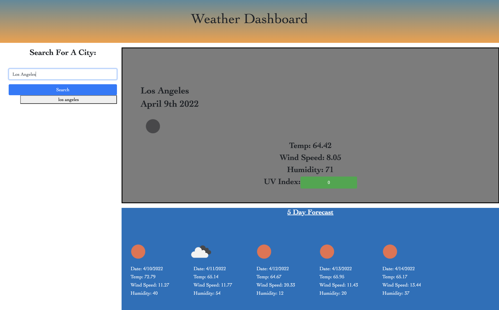

# Weather App Created By Jade Huynh

### My weather application was developed to be able to search for current and forecasted conditions in the future. API's were used to retrieve specific data targeting coordinates of the "searched city" and then concatenated into another API URL to load the data.

### Simply search a desired city or cities, and there will be a list created below to store previous selections. You are then able to also retrieve current weather and forecasted conditions for that city.

### Displaying the current data is a section in gray showing the name of the city, date, and icon representing the current conditions. It also displays the temperature, wind speed, humidity, and UV Index with a button. The 5 Day Forecast shows similar conditions, but fortunately I was abe to successfully get a displayed icon and date in each card.

### Once the browser is refreshed, the searched names will also be stored in the local storage.

[Check out the weather application here!](https://jadehuynh.github.io/weather-app/).

## 
[Prompt displays informing user of rules. Once the player clicks'OK' the game begins!](./assets/image/gamephoto.png)

 

 

[Click this link to test your JavaScript knowledge!](https://jadehuynh.github.io/timed-game/) 